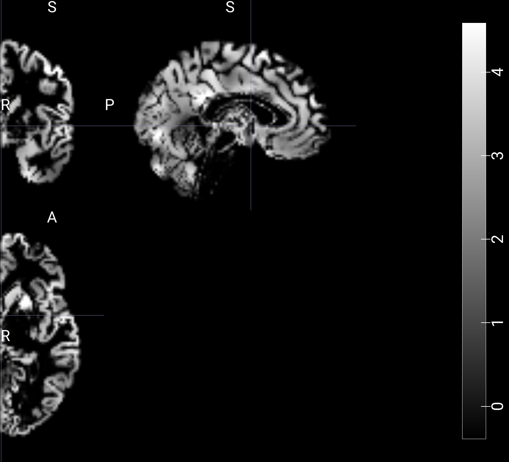

# Post-analysis
--------------

## Correciones sobre **pre.md**
- Aplicamos la estandarización del zscore de forma "manual", debido a que realizar el procedimiento con el transformer de julearn tardaba demasiado tiempo
y configurar una pipeline completa para unicamente aplicar el zscore resulta innecesario. (En el paper no figuraba que este paso se hacia con julearn, simplemente pensamos que sería más rápido y sencillo de lo que en realidad es).
- No queda claro en **pre.md**, pero FSL *randomise* se utiliza para realizar la t-test, y luego se utliza *cluster* y *atlasquery* para analizar y reportar los resultados de *randomise*.
- Tampoco queda claro que la comparación utilizando el cociente de lateralidad también es en alta dimensión, puesto que consideramos la imágen completa.
- El paper aclara que el atlas utilizado para `atlasquery` es el **Harvard-Oxford**. Esto no figura en **pre.md**.
- Tambien aclara que se utiliza el mapa LQ promedio para comparar los distintos modelos.
- Se interpretó erróneamente que el algoritmo de Boruta podría ser aplicado utilizando FSL cluster. En realidad, el paper quería decir que se utilizaba FSL cluster para analizar los resultados obtenidos de correr Boruta.
Utilizamos la librería de python [boruta](https://pypi.org/project/Boruta/), junto a 
- Error de interpretación en los threshold de LQ para comparar utilizando DSC: el rango es de 0 a 0.6 (con incrementos de 0.2), en vez de 0.2 a 6. Esto aplica tanto para el caso positivo como el negativo.
- Error al considerar `sklearn.linear_models.LASSO` como modelo para resolver un problema de clasificación, siendo un modelo de regresión. Utilizamos `sklearn.linear_models.LogisticRegression` con `penalty='l1'`, que es equivalente (hasta donde logramos entender).

## Resultados
El proyecto completo puede ser recreado (una vez instalados los requerimientos) ejecutando [run_project.sh](../src/run_project.sh).

###### Aclaraciones
A continuación, cuando hablamos de **dataset1** nos referimos a **PIOP1**, y
**dataset2** se refiere a **PIOP2**

La lista de requerimientos, junto a las versiones de las herramientes utilizadas se encuentra en [README.md](../README.md). Notar que debido a la falta de versiones de muchas de las herramientas al momento de ser utilizadas para realizar el paper, y dado que el paper fue realizado hace un tiempo considerable, es probable que el hecho de que hayamos instalado las últimas versiones de las herramientas genere diferencias en nuestros resultados, más allá de los posibles (y probables) errores humanos.

Además, en el paper se utilizó `python 3.8`. Sin embargo, al tratar de instalar las herramientas necesarias para poder realizar el proyecto, surgieron incompatibilidades técnicas, por lo que dejamos que `conda` determine la versión de python compatible con nuestro stack, que es la listada en el README (3.12.3).

#### Preprocesado
Realizamos el preprocesado utilizando [preprocesado.sh](../src/preprocesado.sh). Este script instala los datasets con datalad, descarga únicamente las imágenes necesarias, y las preprocesa con [preprocess_brain_images.py](../src/preprocess_brain_images.py), que divide los hemisferios y estandariza las nuevas imágenes.

Podemos observar el procedimiento directamente con las imágenes:
- Imágen original (sujeto 1, dataset 1) 
- Hemisferio izquierdo "espejado" 
- Hemisferio derecho 
- Hemisferio izquierdo "espejado" y estandarizado 
- Hemisferio derecho estandarizado 

No se aclara en el paper, pero el midpoint no se incluye en ninguno de los dos hemisferios (puesto que la cantidad de pixeles original es impar (91), inicialmente consideramos incluir el midpoint en ambos hemisferios, pero los cálculos eran considerablemente diferentes a los presentes en el paper).

#### Cociente de lateralidad
Calculamos el LQ para cada dataset con [laterality_quotient_matrices.py](../src/laterality_quotient_matrices.py). Luego, utilizamos [laterality_quotient_t_test.sh](../src/laterality_quotient_t_test.sh) para correr la t-test con TFCE, y analizar los clusters, utilizando FSL. 

- Cociente de lateralidad de un sujeto (sujeto 1, dataset 1) 
- Cociente de lateralidad promedio del dataset 1 

#### UMAP
Reducimos los datos con UMAP con [umap_data.py](../src/umap_data.py), para luego procesarlos con una SVM con julearn (con hiperparámetros por defecto, ya que no se especifica nada) en [umap_svm.py](../src/umap_svm.py).

Dado que UMAP es un algoritmo que utiliza la aleatoriedad (stochastic algorithm), al no tener la seed utilizada en el paper, no podemos replicar exactamente los resultados. Setamos nuestra seed a `1000`, y obtuvimos los siguientes plots (correspondientes a los datasets 1 y 2, respectivamente)

Podemos observar la similaridad con los plots originales, y se nota claramente que UMAP identifica diferencias entre ambos hemisferios, puesto que los agrupa de forma tal que se puede apreciar un patrón de pertenencia a un "cluster" o porción del nuevo espacio bidimensional.

#### LASSO y Boruta

#### Figuras y estadísticas

#### Sexo y mano hábil

## Conclusión