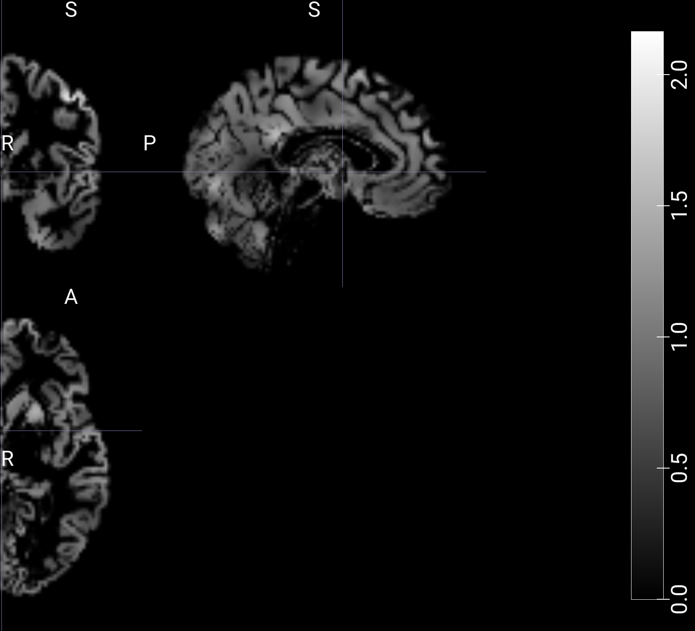

# Post-analysis
--------------

## Correcciones sobre **pre.md**
- Aplicamos la estandarización del zscore de forma "manual", debido a que realizar el procedimiento con el transformer de julearn tardaba demasiado tiempo
y configurar una pipeline completa para únicamente aplicar el zscore resulta innecesario. (En el paper no figuraba que este paso se hacia con julearn, simplemente pensamos que sería más rápido y sencillo de lo que en realidad es).
- No queda claro en **pre.md**, pero FSL *randomise* se utiliza para realizar la t-test, y luego se utliza *cluster* y *atlasquery* para analizar y reportar los resultados de *randomise*.
- Tampoco queda claro que la comparación utilizando el cociente de lateralidad también es en alta dimensión, puesto que consideramos la imagen completa.
- El paper aclara que el atlas utilizado para `atlasquery` es el **Harvard-Oxford**. Esto no figura en **pre.md**.
- También aclara que se utiliza el mapa LQ promedio para comparar los distintos modelos.
- Se interpretó erróneamente que el algoritmo de Boruta podría ser aplicado utilizando FSL cluster. En realidad, el paper quería decir que se utilizaba FSL cluster para analizar los resultados obtenidos de correr Boruta.
Utilizamos la librería de python [boruta](https://pypi.org/project/Boruta/), junto a 
- Error de interpretación en los threshold de LQ para comparar utilizando DSC: el rango es de 0 a 0.6 (con incrementos de 0.2), en vez de 0.2 a 6. Esto aplica tanto para el caso positivo como el negativo.
- Error al considerar `sklearn.linear_models.Lasso` como modelo para resolver un problema de clasificación, siendo un modelo de regresión. Utilizamos `sklearn.linear_models.LogisticRegression` con `penalty='l1'`, que es equivalente (hasta donde logramos entender).
- Error al considerar DSC para sexo y mano hábil: en este caso DSC no se usa para comparar entre los modelos, sino para comparar las distintas salidas del algoritmo de Boruta entre los voxels elegidos para personas zurdas, diestras, y ambidiestras.
- En el paper se realizan t-tests independientes y F-tests sobre los datos de UMAP. No lo incluimos en el pre.md. Podríamos realizarlas pero no estábamos seguro sobre qué datos (los resultados, los voxeles, los nuevos valores dados por UMAP), y preferimos no hacer algo sin saber lo que estábamos haciendo.

## Resultados
El proyecto completo puede ser recreado (una vez instalados los requerimientos) ejecutando [run_project.sh](../src/run_project.sh).
No logramos completar una porción considerable de los objetivos planteados en `pre.md`. Consideramos justo y razonable si esto descalifica el trabajo, y pedimos disculpas por no haber considerado estas posibilidades de antemano.

###### Aclaraciones
A continuación, cuando hablamos de **dataset1** nos referimos a **PIOP1**, y
**dataset2** se refiere a **PIOP2**

La lista de requerimientos, junto a las versiones de las herramientas utilizadas se encuentra en [README.md](../README.md). Notar que debido a la falta de versiones de muchas de las herramientas al momento de ser utilizadas para realizar el paper, y dado que el paper fue realizado hace un tiempo considerable, es probable que el hecho de que hayamos instalado las últimas versiones de las herramientas genere diferencias en nuestros resultados, más allá de los posibles (y probables) errores humanos.

Además, en el paper se utilizó `python 3.8`. Sin embargo, al tratar de instalar las herramientas necesarias para poder realizar el proyecto, surgieron incompatibilidades técnicas, por lo que dejamos que `conda` determine la versión de python compatible con nuestro stack, que es la listada en el README (3.12.3).

#### Preprocesado
Realizamos el preprocesado utilizando [preprocesado.sh](../src/preprocesado.sh). Este script instala los datasets con datalad, descarga únicamente las imagenes necesarias, y las preprocesa con [preprocess_brain_images.py](../src/preprocess_brain_images.py), que divide los hemisferios y estandariza las nuevas imagenes.

Podemos observar el procedimiento directamente con las imagenes:
- imagen original (sujeto 1, dataset 1) 
- Hemisferio izquierdo "espejado" 
- Hemisferio derecho 
- Hemisferio izquierdo "espejado" y estandarizado 
- Hemisferio derecho estandarizado 

No se aclara en el paper, pero el midpoint no se incluye en ninguno de los dos hemisferios (puesto que la cantidad de pixeles original es impar (91), inicialmente consideramos incluir el midpoint en ambos hemisferios, pero los cálculos eran considerablemente diferentes a los presentes en el paper).

#### Cociente de lateralidad
Calculamos el LQ para cada dataset con [laterality_quotient_matrices.py](../src/laterality_quotient_matrices.py). Luego, utilizamos [laterality_quotient_t_test.sh](../src/laterality_quotient_t_test.sh) para correr la t-test con TFCE, y analizar los clusters, utilizando FSL. 

No pudimos utilizar `atlasquery` dado que el atlas utilizado y nuestras imagenes están en distintos espacios.

- Cociente de lateralidad de un sujeto (sujeto 1, dataset 1) 
- Cociente de lateralidad promedio del dataset 1 

Una vez computados los voxels significantes con `randomise`, nos quedamos únicamente con aquellos cuyo valor (representando 1-p) es mayor o igual a 0.95, para obtener las siguientes imagenes.

- Dataset 1
 
- Dataset 2


#### UMAP
Reducimos los datos con UMAP con [umap_data.py](../src/umap_data.py), para luego procesarlos con una SVM con julearn (con hiperparámetros por defecto, ya que no se especifica nada) en [umap_svm.py](../src/umap_svm.py).

Dado que UMAP es un algoritmo que utiliza la aleatoriedad (stochastic algorithm), al no tener la seed utilizada en el paper, no podemos replicar exactamente los resultados. Setamos nuestra seed a `1000`, y obtuvimos los siguientes plots (correspondientes a los datasets 1 y 2, respectivamente)

- 
- 

Podemos observar la similaridad con los plots originales, y se nota claramente que UMAP identifica diferencias entre ambos hemisferios, puesto que los agrupa de forma tal que se puede apreciar un patrón de pertenencia a un "cluster" o porción del nuevo espacio bidimensional.

Precisión (de clasificación de hemisferio) para las distintas 'runs' con CV
- Dataset 1 
```
0    0.862069
1    0.793103
2    0.767442
3    0.825581
4    0.674419

Promedio = 0.7845228
```
- Dataset 2
```
0    0.791209
1    0.846154
2    0.722222
3    0.800000
4    0.711111

Promedio = 0.7741392
```

Comparando con el paper original, nuestros scores son relativamente menores, pero en un rango considerablemente aceptable. Las diferencias probablemente se deban a errores (humanos, nuestros) en el pipeline, y a la posibilidad de aleatoriedad no replicable (debido a falta de información sobre el estudio original).

#### LASSO y Boruta
En primer lugar, utilizamos `sklearn.linear_model.LogisticRegression` en lugar de `sklearn.linear_model.Lasso` dado que este modelo Lasso sirve para problemas de regresión, y luego de investigar un poco encontramos que para un problema de clasificación, es equivalente tomar el modelo de regresión logística, utilizando `l1` como penalización. El codigo relevante se encuentra en [lasso_boruta.py](../src/lasso_boruta.py).

Por otra parte, al tratar de computar los features relevantes con Boruta, encontramos que no tenemos el suficiente poder de cómputo para poder llevar a cabo esta cuenta con todos los sujetos. Intentamos considerar menos sujetos, reducir la dimensión de las imagenes, y demás métodos, pero finalmente decidimos no realizar este paso. (Un ejemplo fue computar una máscara de todos los pixeles que alguna vez son no nulos a lo largo de todas las imagenes, con [mask.py](../src/mask.py) **Utilizamos esta mascara para la parte de Lasso**).

Precisión (de clasificación de hemisferio) para las distintas 'runs' con CV
- Dataset 1 
```
0    1.000000
1    1.000000
2    0.972222

Promedio = 0.9924074
```
- Dataset 2
```
0    0.986755
1    0.993377
2    0.993333

Promedio = 0.991155
```

Comparando con el paper original, nuestros scores son relativamente altos, posiblemente presentando un severo caso de overfitting. Las diferencias se pueden atribuir a los mismos factores que en el caso de UMAP.

#### DSC
Para obtener el DSC, utilizamos [dsc.py](../src/dsc.py) (junto a [figure2.py](../src/figure2.py)). Obtenemos las siguiente figuras

- 
- 

Estas figuras no son para nada similares con el paper original. En primer lugar, el rango de valores del LQ promedio es diferente (además de estar en otro espacio). Luego, la cantidad de voxeles significativos presenta una distribución espacial completamente diferente, y a simple vista una cantidad total mucho mayor. Finalmente, el gráfico con la comparación con DSC, es similar en la parte "rightward", pero considerablmente diferente en la parte "leftward".

Estos errores se deben a una falta de planeación apropiada, diferencias en el preprocesado y procesado de los datos, y nuevamente error humano.

#### Sexo y mano hábil
Separamos los sujetos por sexo y mano hábil, descartando aquellos que no presentan valores en esa columna, y aplicamos todos los modelos y procedimientos anteriores utilizando [sex_and_handedness.py](../src/sex_and_handedness.py) (junto a [figure3.py](../src/figure3.py)).

Obtuvimos las siguientes figuras
- 
- 

Las precisiones son similares en términos de sus relaciones, pero en valor absoluto el rendimiento es pésimo comparado con el original. Notar que los gráficos se parezcan o no a simple vista no determina nada, puesto que UMAP es estocástico, y depende de la semilla aleatoria utilizada.

Precisión promedio con LASSO

- Dataset 1
    - Males `0.972034`
    - Females `0.966668`
    - Right-handed `0.986111`
    - Non right-handed `0.833334`
- Dataset 2
    - Males `0.947916`
    - Females `0.980620`
    - Right-handed `0.982587`
    - Non right-handed `0.525397`

Estos valores de precisión son bastante similares al paper original, salvo los 'non right-handed' en el dataset 2.

## Conclusión
No logramos replicar todos los aspectos del paper original. Tuvimos una enorme cantidad de errores, principalmente en el planteamiento de `pre.md`, no tenemos un archivo `.yaml` para realizar esto con `junifer`.

Lo único a destacar sería la similaridad de los resultados con respecto al paper original. Tomando en cuenta estos datos, podemos decir que el paper puede ser replicado, y que se pueden obtener conclusiones similares si se observan únicamente nuestros datos.
